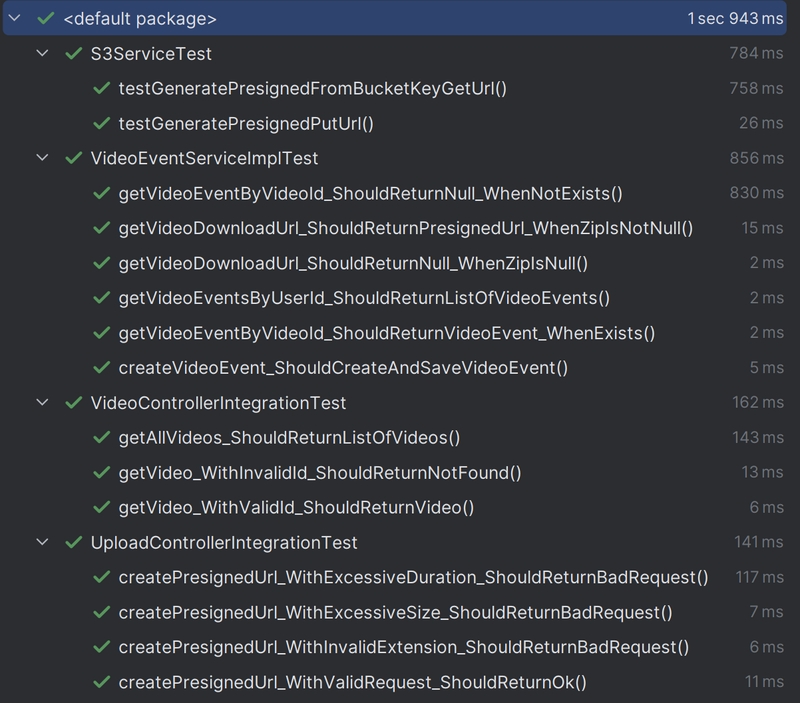
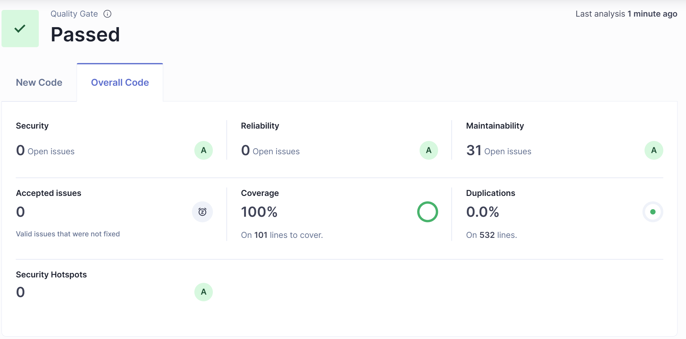
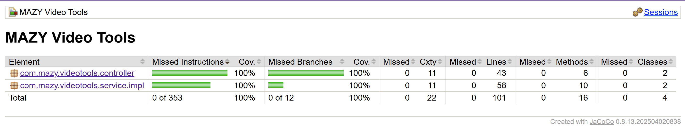

# MAZY Video Tools API

This Spring Boot service issues pre‑signed S3 URLs to front‑end upload videos straight to Amazon S3.

## Features

* **`POST /api/presign-upload`** – validates the requested filename, size (≤ 2 GB) and declared duration (≤ 60 min) before returning a 15‑minute pre‑signed HTTPS `PUT` URL.
* AWS credentials are injected with environment variables **`AWS_ACCESS_KEY_ID` + `AWS_SECRET_ACCESS_KEY` + `AWS_SESSION_TOKEN`**; long‑lived keys are **not** required.
* JWT authentication is handled by Spring Security + the Cognito JWKS endpoint (`COGNITO_ISSUER_URI`).

## Running locally (Docker)

```bash
cp .env.example .env
docker compose up
```

## Variables

| Variable | Description |
|----------|-------------|
| `AWS_ACCESS_KEY_ID` | Temporary access key. |
| `AWS_SECRET_ACCESS_KEY` | Temporary secret key. |
| `AWS_SESSION_TOKEN` | Temporary session token. |
| `AWS_REGION` | AWS region (default `us-east-1`). |
| `UPLOAD_BUCKET_NAME` | Name of the S3 bucket where the videos are stored. |
| `COGNITO_ISSUER_URI` | The issuer URI of your Cognito User Pool (e.g. `https://cognito-idp.<region>.amazonaws.com/<pool-id>`). |

## Makefile targets

* `make build` – compila o JAR
* `make docker-build` – gera a imagem Docker
* `make push` – envia a imagem para o ECR

---

## Qualidade do Código

### Testes unitários


### SonarQube


### Cobertura de Testes


---
